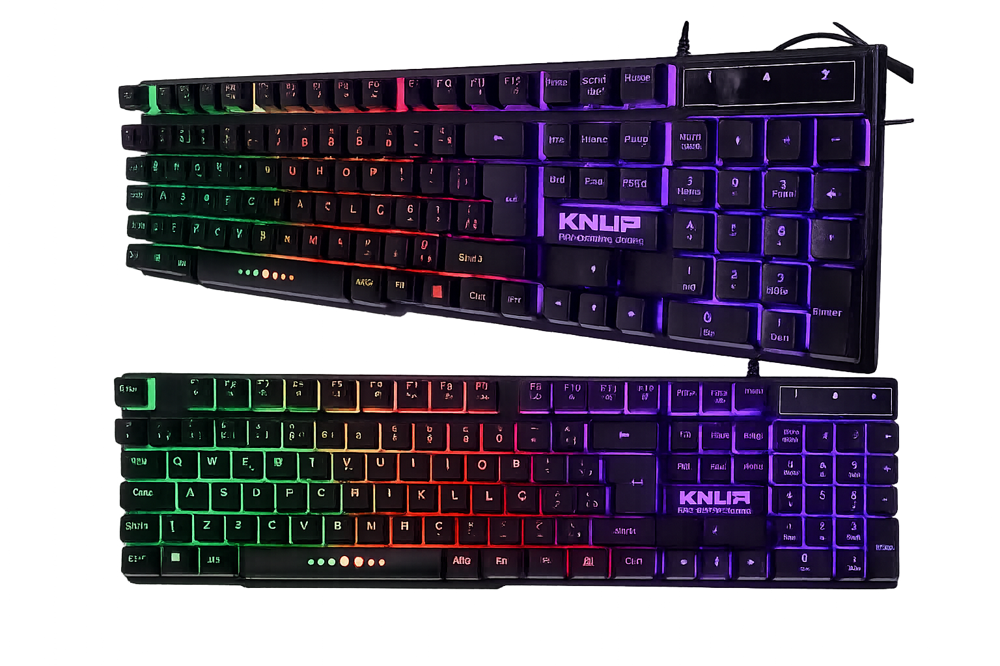

## O que é isso?

GlowKey nasceu de uma frustração real. Onde tinha trocado meu teclado por um que é RGB e no Linux o LED simplesmente não ligava. Funcionava perfeitamente no Windows, mas no Linux nada, Zero. Escuridão total.

Pesquisei bastante, testei alternativas, nada resolveu. Até que fui mais fundo e descobri que esses teclados usam o LED do Scroll Lock (LED 3) pra controlar o backlight e esse comportamento simplesmente não é ativado por padrão em ambientes X11.

A solução foi simples. O trabalho de descobrir, não tanto.

Então criei o GlowKey um script pequeno que usa `xset` pra restaurar esse controle e poupar outras pessoas do mesmo caminho.

---

## Para quem é

Se você tem um teclado genérico com RGB que funciona no Windows mas fica apagado no Linux, provavelmente chegou no lugar certo.

<div>
 
</div>

GlowKey foi feito especialmente para:

- Teclados genéricos sem software oficial para Linux
- Modelos OEM rebrand (aqueles que mudam só a caixinha)
- Teclados "Windows-only" com iluminação RGB
- Qualquer teclado cujo backlight responde ao LED 3 (Scroll Lock)

---

## Antes de instalar — teste se funciona com o seu

Abra o terminal e rode:

```bash
xset led 3
```

Se a iluminação acender, ótimo. Agora apaga:

```bash
xset -led 3
```

Se apagou, o GlowKey vai funcionar pra você.

Se não aconteceu nada nos dois comandos, infelizmente seu teclado usa outro mecanismo e o GlowKey não vai ajudar (pelo menos por enquanto).

---

## Dependências

Você vai precisar de:

- Linux com sessão **X11** ativa (Wayland ainda não é suportado, mais sobre isso abaixo)
- O utilitário `xset`, que provavelmente já está instalado, mas se não estiver:

```bash
sudo apt install x11-xserver-utils
```

### Verificando se você está no X11

```bash
echo $XDG_SESSION_TYPE
```

Se retornar `x11`, pode seguir em frente.

> ⚠️ **Wayland:** ainda não há suporte. É algo que quero explorar futuramente, mas por enquanto o GlowKey depende do X11 pra funcionar.

---

## Instalação

```bash
git clone https://github.com/joaomjbraga/glowkey.git
cd glowkey
./install.sh
```

Se o comando `glowkey` não for reconhecido depois, adicione ao PATH:

```bash
export PATH="$HOME/.local/share:$PATH"
```

## Desinstalação

```bash
./uninstall.sh
```

---

## Como usar

```bash
glowkey on        # Liga a iluminação
glowkey off       # Desliga a iluminação
glowkey toggle    # Alterna entre ligado e desligado
glowkey status    # Mostra o estado atual
glowkey restore   # Restaura o último estado salvo
glowkey --help    # Mostra a ajuda
glowkey --version  # Mostra a versão
```

---

## Auto-inicialização

O GlowKey salva automaticamente o estado do backlight toda vez que você usa `on`, `off` ou `toggle`. No próximo login, o estado será restaurado automaticamente via XDG Autostart.

Para desativar a auto-inicialização via XDG Autostart, remova o arquivo:

```bash
rm ~/.config/autostart/glowkey.desktop
```

## Contribuindo

Se funcionou (ou não funcionou) com algum teclado específico, abre uma issue e me conta. Relatos de compatibilidade ajudam muito a entender quais dispositivos o projeto já alcança — e quais ainda precisam de atenção.

Pull requests também são bem-vindos.
